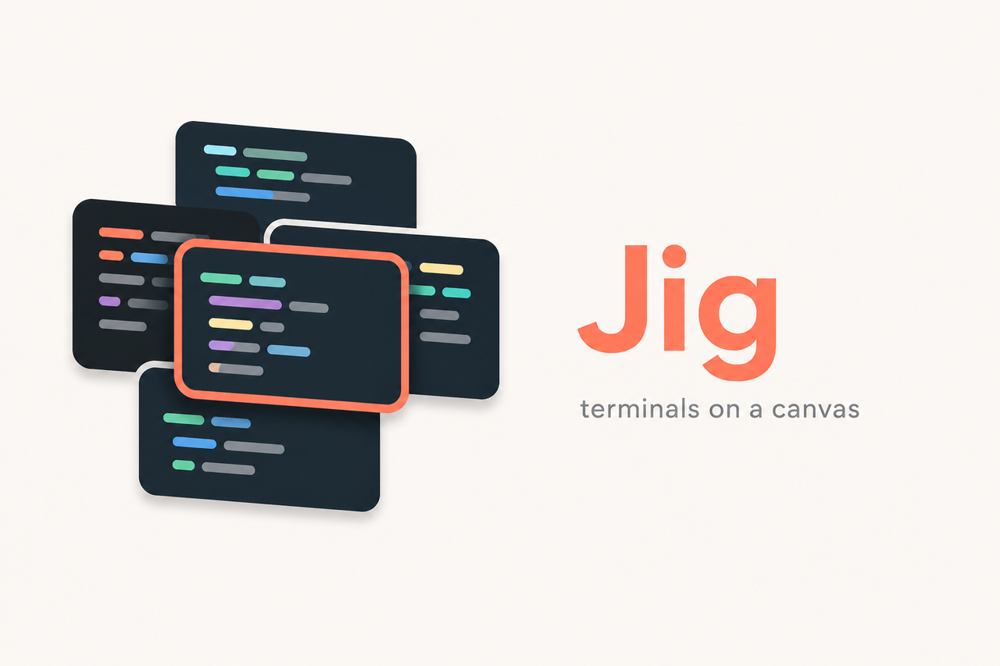

# Jig

Terminals on a canvas.



## Install and run

Jig is a local-first desktop app for Linux and macOS. Windows is out of scope for Beta v0.1.

### Prerequisites

- Node.js 22 or newer
- Corepack and pnpm 11
- Rust 1.85 or newer
- Git on PATH
- Tauri 2 dependencies (WebKitGTK 4.1 on Linux, Xcode Command Line Tools on macOS)

### Development

```bash
# Enable package manager and install dependencies
corepack enable
pnpm install --frozen-lockfile

# Run the desktop app
pnpm tauri dev
```

### Build from source

```bash
# Stage daemon and build platform bundle (AppImage on Linux, .app and .dmg on macOS)
pnpm package
```

Builds are unsigned. macOS notarization is not configured. See [docs/install.md](docs/install.md) for platform-specific installation and verification steps.

## What it is

Jig hosts coding-agent CLIs in real terminals with projects and Git worktrees. It coordinates OpenAI Codex, Claude Code, Gemini CLI, OpenCode, and custom executables in isolated PTY sessions.

**Current status:** Beta v0.1 architecture exists. The daemon, PTY management, and storage layers are operational. The IPC protocol is defined in `crates/core/src/wire`. Session creation, worktree isolation, and the terminal canvas UI are in active development. See [docs/KNOWN_ISSUES.md](docs/KNOWN_ISSUES.md) for the current domain-IPC gap and [ARCHITECTURE.md](ARCHITECTURE.md) for accepted design decisions.

This is a local-first application. No cloud account, telemetry, or vendor proxy is required. Each agent CLI keeps its own authentication.

### How it works

```text
React + xterm.js
       │ typed Tauri commands and events
       ▼
Tauri 2 desktop bridge
       │ versioned local IPC
       ▼
jig daemon
       ├── PTY session manager ── Codex / Claude / Gemini / OpenCode
       ├── Git and worktree service
       └── SQLite metadata storage
```

The separate daemon owns live PTYs and SQLite. Closing the desktop window does not stop active sessions. Read [ARCHITECTURE.md](ARCHITECTURE.md) for protocol, schema, lifecycle, and safety decisions.

## Supported platforms

- **Linux:** First-class. AppImage is the initial package format.
- **macOS:** First-class on Apple Silicon and supported modern releases. `.app` and `.dmg` artifacts.
- **Windows:** Out of scope for Beta v0.1.

## Validate changes

Run the repository gate before committing:

```bash
pnpm check
pnpm check:versions
cargo fmt --all -- --check
cargo clippy --workspace --all-targets -- -D warnings
cargo test --workspace
pnpm --filter @cli-master/desktop test:e2e
```

`pnpm check` type-checks and builds the frontend, then checks every Rust crate. `pnpm check:versions` ensures Cargo, npm, Tauri, and the protocol catalog agree.

Runtime acceptance for sessions, worktree isolation, and daemon recovery lives in `crates/e2e`. Platform-specific PTY tests run in Linux and macOS CI jobs.

## Repository layout

```text
apps/desktop/               React, TypeScript, Vite, Tauri bridge, Playwright
crates/                     Rust domain, storage, Git, PTY, daemon, e2e
crates/fake-agent           Interactive coding-agent stand-in for Beta tests
crates/e2e                  Acceptance tests against production crates
docs/                       Install, packaging, and recovery guides
docs/brand/                 Jig brand assets
ARCHITECTURE.md             Accepted architecture and protocol design
AGENTS.md                   Crate ownership and IPC rules
protocol/catalog.json       Frozen v1 method names
```

## Safety principles

- Commands use an executable plus an argument array, not interpolated shell strings
- Removing a project never removes its repository directory
- Worktrees with uncommitted changes are never silently deleted
- Stopping a process and deleting session metadata are separate actions
- Full environments, tokens, and terminal contents are excluded from logs

See [CONTRIBUTING.md](CONTRIBUTING.md) before opening a change.
